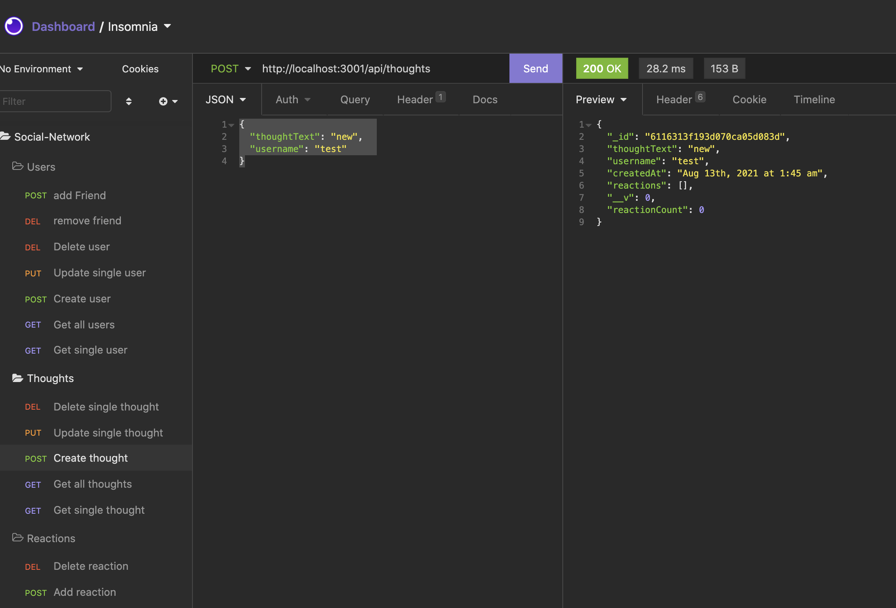

# social-network-API

Creating the backend for a social media app using MongoDB.

Screenshot of Insomia to test out the different routes.



|                                         |                                         |                                                   |
| :-------------------------------------: | :-------------------------------------: | :-----------------------------------------------: |
|   [Introduction](#social-network-API)   | [Table of Contents](#table-of-contents) | [Development Highlights](#development-highlights) |
|      [Installation](#installation)      |    [Page Directory](#page-directory)    |       [Code Hightlights](#code-highlights)        |
| [Technologies Used](#Technologies-Used) |           [Credits](#Credits)           |                [License](#License)                |

## Development Highlight

- Created models with Mongoose.

- Used viruals to extend the models' functionality.

- Created subschemas and subdocuments with Mongoose.

## Installation

1. Install node modules

```
npm i
```

2. Open MongoDB

```
mongodb
```

3. Start App

```
npm start
```

Makes request using Port 3001.

## Page Directory

### Controllers

The controller contains the methods we used for the routes.

### Models

The models directory contains the User and Thought models.. An index.js is used to sotre the 2 models.

### Routes

The api routes contain the methods found in the controller.

## Code Highlights

Connected the methods in the controller to the thought routes.

```JavaScript
const router = require('express').Router();
const { getAllThoughts, getThoughtById, createThought, updateThought, deleteThought, addReaction, removeReaction } = require('../../controllers/thought-controller');

// api/thoughts
router
    .route('/')
    .get(getAllThoughts)
    .post(createThought)

// api/thoughts/:id
router
    .route('/:id')
    .get(getThoughtById)
    .put(updateThought)
    .delete(deleteThought)

// api/thoughts/:thoughtId/reactions
router
    .route('/:thoughtId/reactions')
    .post(addReaction)

// api/thoughts/:thoughtId/reactions/:reactionId
router
    .route('/:thoughtId/reactions/:reactionId')
    .delete(removeReaction)

module.exports = router;
```

The addFriend method where a User is found and then a friend is added to the set.

```JavaScript
    // add friend
    addFriend({ params, body }, res) {
        User.findOneAndUpdate(
            { _id: params.userId },
            { $addToSet: { friends: params.friendId } },
            {
                new: true,
                runValidators: true
            }
        )
            .then(dbUserData => {
                if (!dbUserData) {
                    return res.status(404).json({ message: 'No user found with this id' });
                }
                res.json(dbUserData)
            })
            .catch(err => res.status(500).json(err))
    },
```

## Technologies

### Backend Language

- [Node.js](https://nodejs.org/en/)

### Backend Framework

- [Express.js](https://expressjs.com/)

### Database

- [MongoDB](https://www.mongodb.com/)

## Credits

|                           |                                                                                                                                                                                                       |
| ------------------------- | ----------------------------------------------------------------------------------------------------------------------------------------------------------------------------------------------------- |
| **David Anusontarangkul** | [ LinkedIn](https://www.linkedin.com/in/anusontarangkul/) [ GitHub](https://github.com/anusontarangkul) |

## License

[](https://opensource.org/licenses/MIT)
